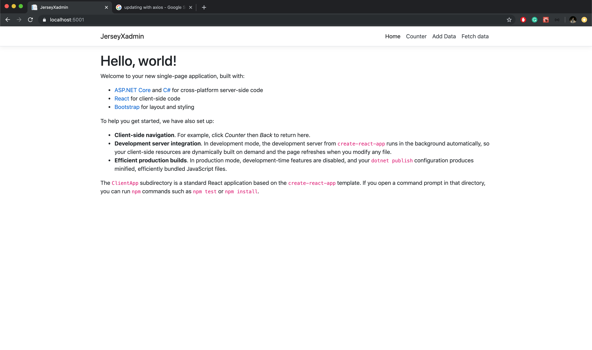
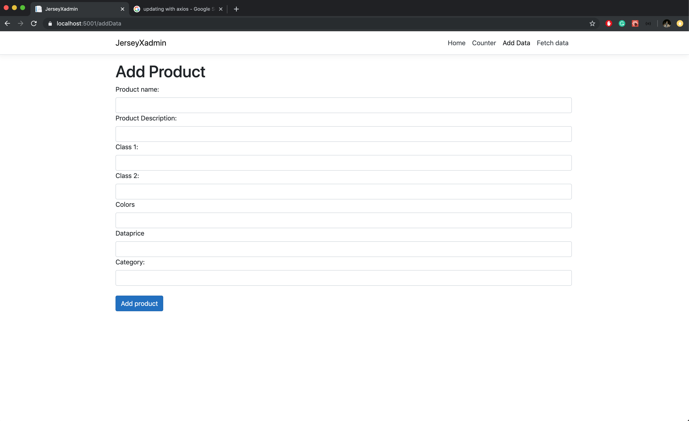
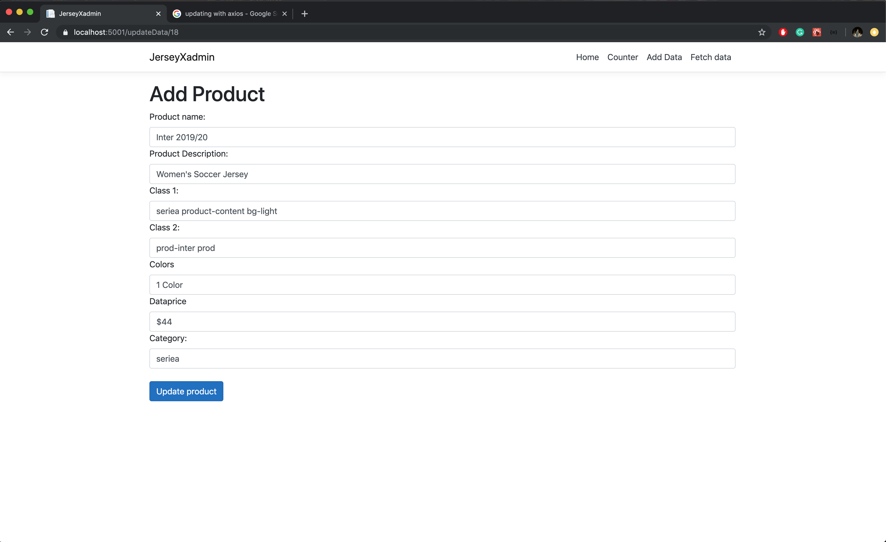
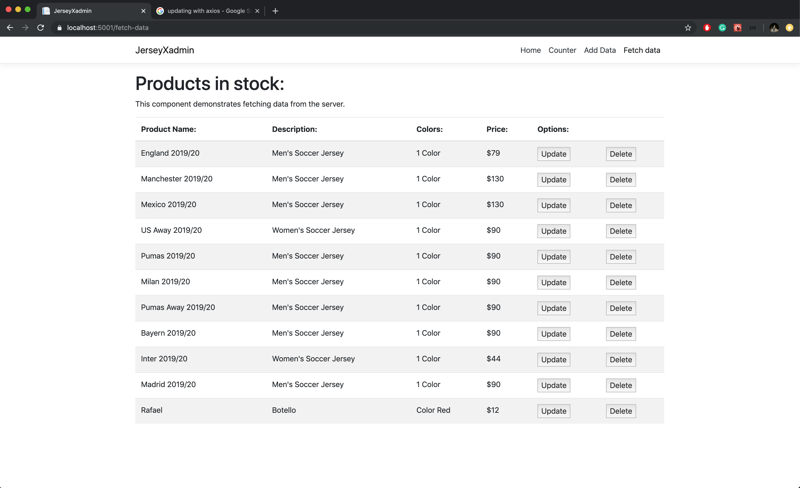

# C# Admin Page for MYSQL database.

This project is a react admin page for a mysql database using a C# Api server.

## Author

- [Rafael botello](https://github.com/RafaelBotello)

## Screenshots

### Home

### Create

### Update

### Read

## License

This project is licensed under the MIT License - see the [LICENSE.md](LICENSE.md) file for details
